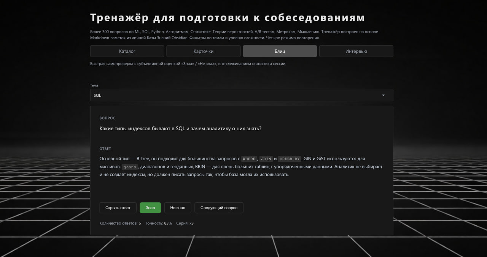

# Train to DA

Статический [веб-тренажёр](https://train-to-da.vercel.app/index.html) для подготовки к собеседованиям на позицию DA / DS / ML.

Тренажёр построен на основе Markdown-заметок из личной Базы Знаний Obsidian.
Основная цель — системное повторение теории, активное вспоминание и симуляция интервью.


## Возможности

- Более 300+ вопросов по SQL, Python, ML, Алгоритмам, Статистике, A/B тестам и т.д.
- Фильтрация по темам и уровню сложности
- 4 режима повторения:
  - Каталог
  - Карточки
  - Блиц
  - Интервью
- Статический хостинг через GitHub Pages


## Структура проекта

```
.
├── database/
│ ├── Train to DA.md              # оглавление, описание тем
│ ├── №1.md                       # карточки вопрос/ответ
│ ├── №2.md
│ └── ...
├── api/
│ └── interview.py                # проверка ответов через OpenAI API
├── assets/
│ ├── css/
│ │ └── style.css
│ ├── js/
│ │ ├── data.js                   # загрузка data.json
│ │ ├── filters.js                # фильтрация по теме, по уровню
│ │ ├── catalog.js                # логика каталога, рендер карточек, счётчики
│ │ ├── cards.js                  # логика режима карточек
│ │ ├── blitz.js                  # логика режима блиц
│ │ ├── interview.js              # логика режима интервью
│ │ └── mobile-warning.js         # предупреждение для мобильных устройств
│ └── icons/                      # картинки, иконки, фоны
│   ├── readme.jpg
│   ├── favicon.png
│   └── image.jpg
├── build.py                      # сборка data.json
├── data.json                     # единый источник данных
├── index.html                    # главная, режим каталог
├── cards.html                    # режим карточек
├── blitz.html                    # режим блиц
├── interview.html                # режим интервью
├── requirements.txt              # зависимости
├── vercel.json                   # конфигурация Vercel
└── README.md
```


## Сборка данных

Подразумевается что общая База Знаний с карточками уже собрана, и перенесена в папку database/.

Каждая карточка это отдельный .md файл формата:
```
Вопрос
---
Ответ
---
#lvl_1
```

Для генерации `data.json`:

```bash
python build.py
```

- читает все `.md`
- парсит вопросы, ответы, теги
- формирует структуру данных для фронта


## Тренажёр




## Author

(C) 2025 Goncharov Ivan
