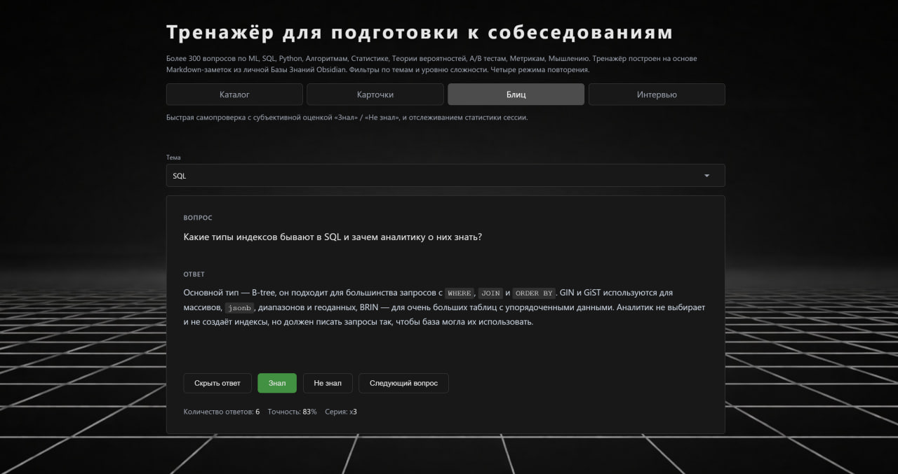
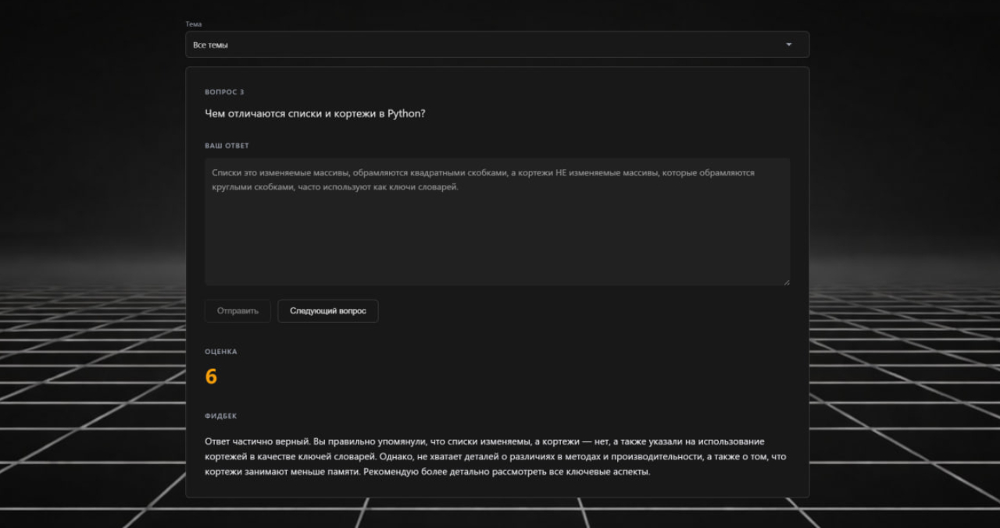

# Train to DA

Статический [веб-тренажёр](https://train-to-da.vercel.app/index.html) для подготовки к собеседованиям на позицию DA / DS / ML.

Тренажёр построен на основе Markdown-заметок из личной Базы Знаний Obsidian.
Основная цель, системное повторение теории, активное вспоминание и симуляция интервью.


## Возможности

- Более 300+ вопросов по SQL, Python, ML, Алгоритмам, Статистике, Теории Вероятности.
- Фильтрация по темам и уровню сложности
- 4 режима повторения:
  - Каталог
  - Карточки
  - Блиц
  - Интервью
- Статический хостинг через GitHub Pages + Vercel
- Короткий фидбек от gpt-4o в режиме Интервью


## Структура проекта

```
.
├── database/
│ ├── Train to DA.md              # оглавление, описание тем
│ ├── №1.md                       # карточки вопрос/ответ
│ ├── №2.md
│ └── ...
├── api/
│ └── interview.py                # OpenAI API
├── assets/
│ ├── css/
│ │ └── style.css                 # визуальная часть
│ ├── html/
│ │ ├── index.html                # режим каталог
│ │ ├── cards.html                # режим карточек
│ │ ├── blitz.html                # режим блиц
│ │ └── interview.html            # режим интервью
│ ├── js/
│ │ ├── data.js                   # загрузка data.json
│ │ ├── filters.js                # фильтрация по теме, по уровню
│ │ ├── catalog.js                # логика каталога, рендер карточек, счётчики
│ │ ├── cards.js                  # логика режима карточек
│ │ ├── blitz.js                  # логика режима блиц
│ │ ├── interview.js              # логика режима интервью
│ │ └── mobile-warning.js         # предупреждение для мобильных устройств
│ └── icons/
├── build_data.py                 # сборка data.json
├── data.json                     # единый источник данных
├── requirements.txt
├── vercel.json
└── README.md
```


## Сборка данных

Подразумевается что общая База Знаний с карточками уже собрана, и перенесена в папку database/.

Каждая карточка это отдельный `.md` файл формата:
```
Вопрос
---
Ответ
---
#lvl_1
```

Для генерации `data.json`:

```bash
python build_data.py
```


## Тренажёр






## Author

(C) 2025 Goncharov Ivan
